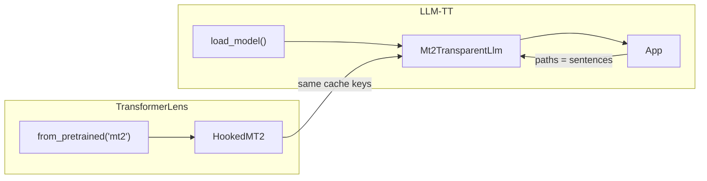

# MT2 + LLM Transparency Tool integration plan

## Scope and assumptions

- **TransformerLens**: Add MT2 as a loadable model returning a hookable model with the same cache interface as `HookedTransformer` (so contribution graph code can be reused).
- **LLM-TT**: Use a dedicated `TransparentLlm` adapter for MT2 (wrapping the TransformerLens hookable MT2) and wire the app so "mt2" can be selected; "sentences" are one audio file path per line in the dataset file.
- **Dataset**: Preloaded and user-added "sentences" are audio file paths (one per line); no change to the existing dataset UI structure beyond interpretation of the string.

## Architecture (high level)

- **Stream A** builds `HookedMT2` in TransformerLens and a way to load it (e.g. `from_pretrained("mt2", checkpoint_path=...)` or equivalent).
- **Stream B** implements `Mt2TransparentLlm` in LLM-TT, which wraps that model and satisfies the `[TransparentLlm](llm_transparency_tool/models/transparent_llm.py)` API (run from paths, expose residuals/attn/FFN/unembed).
- **Stream C** wires the app: config, `load_model` branching for "mt2", and treating dataset lines as audio paths.

---

## Work stream A: TransformerLens — HookedMT2 and loading

**Goal**: TransformerLens can load MT2 and expose a run-with-cache API whose activation cache uses the same naming as `HookedTransformer` so LLM-TT’s graph/contribution code can be reused.

| Task   | Description                                                                                                                                                                                                                                                                                                                                                                                                                                                                                                                                                                                                                                                                                                                                                                                                                                                                                                                                                                  | Solution acceptance                                                                                                                                                                                   |
| ------ | ---------------------------------------------------------------------------------------------------------------------------------------------------------------------------------------------------------------------------------------------------------------------------------------------------------------------------------------------------------------------------------------------------------------------------------------------------------------------------------------------------------------------------------------------------------------------------------------------------------------------------------------------------------------------------------------------------------------------------------------------------------------------------------------------------------------------------------------------------------------------------------------------------------------------------------------------------------------------------- | ----------------------------------------------------------------------------------------------------------------------------------------------------------------------------------------------------- |
| **A1** | Add MT2 to the TransformerLens loading registry and entrypoint. In [TransformerLens/transformer_lens/loading_from_pretrained.py](TransformerLens/transformer_lens/loading_from_pretrained.py): add an official or custom model name (e.g. `"mt2"`), handle it in `get_official_model_name` so it resolves to `"mt2"`, and in the loading path (or a dedicated loader) accept a checkpoint path (e.g. via `kwargs` or a `checkpoint_path` argument) and load MT2 state dict from [mt2/model_state_dict.pt](mt2/model_state_dict.pt) or user path. Do not call HuggingFace for this model.                                                                                                                                                                                                                                                                                                                                                                                     | `get_official_model_name("mt2")` returns `"mt2"`; a documented way to load MT2 from a local checkpoint exists and does not call HF.                                                                   |
| **A2** | Implement `HookedMT2` (or equivalent) in TransformerLens. The class wraps the MT2 ViT backbone (from [mt2/src/utils/vit.py](mt2/src/utils/vit.py): `Block` = pre-norm attn + pre-norm MLP, `Attention` with QKV linear, `MLP` with fc1/act/fc2). It must: (1) load MT2 using the existing MT2 code (dependency on `mt2` package or sys.path), (2) run a forward that takes **audio input** (tensor of shape expected by MT2, e.g. `[batch, samples, 3]`), (3) register hooks so that an `ActivationCache` is populated with keys matching HookedTransformer: `blocks.{layer}.hook_resid_pre`, `blocks.{layer}.hook_resid_mid`, `blocks.{layer}.hook_resid_post`, `blocks.{layer}.attn.hook_pattern`, `blocks.{layer}.attn.hook_v`, `blocks.{layer}.attn.hook_result`, `blocks.{layer}.hook_attn_out`, `blocks.{layer}.mlp.hook_pre`, `blocks.{layer}.mlp.hook_post`, `blocks.{layer}.hook_mlp_out`. Map ViT’s `norm1`/`attn`/`norm2`/`mlp` and residual adds to these names. | For a small test audio tensor, `run_with_cache(audio_tensor)` returns `(logits, cache)`; `cache` has the above keys and shapes `[batch, seq_len, ...]` consistent with layer/head dimensions.         |
| **A3** | Define “logits” and “tokens” for MT2 in HookedMT2. (1) **Logits**: Use MT2’s pitch/output space (e.g. `linear_out_stone` + octave pool) so that a `[batch, seq_len, d_vocab]` tensor is returned (d_vocab = pitch bins). (2) **Tokens**: Expose a sequence length and token indices (e.g. `arange(seq_len)`) so that callers get a consistent `[batch, pos]` token tensor; document that “token” = sequence position (incl. class tokens). No text tokenizer required.                                                                                                                                                                                                                                                                                                                                                                                                                                                                                                       | HookedMT2 exposes `model_info()` (or equivalent) with `n_layers`, `n_heads`, `d_model`, `d_vocab`, and a method returning logits of shape `[batch, pos, d_vocab]` and tokens of shape `[batch, pos]`. |
| **A4** | Implement `decomposed_attn`-equivalent for HookedMT2. LLM-TT’s [tlens_model.py](llm_transparency_tool/models/tlens_model.py) uses `attn.hook_v`, `attn.hook_pattern`, and `W_O` to compute per-head, per-source contributions. HookedMT2 must expose the same (or provide a method that returns a tensor of shape `[batch, pos, key_pos, head, d_model]` from cached V, pattern, and O projection). ViT uses a single `proj` linear (no separate W_O per head); split or adapt so the interface matches.                                                                                                                                                                                                                                                                                                                                                                                                                                                                     | A single forward + cache run yields decomposed attention contributions with shape `[batch, pos, key_pos, head, d_model]` usable by LLM-TT’s contribution code.                                        |
| **A5** | Add tests for HookedMT2: load checkpoint, run_with_cache on a minimal audio tensor, assert cache keys exist and shapes match (resid_pre/mid/post, attn pattern, mlp pre/post), and that logits shape is `[batch, pos, d_vocab]`.                                                                                                                                                                                                                                                                                                                                                                                                                                                                                                                                                                                                                                                                                                                                             | Tests in TransformerLens test suite pass (or a minimal script run confirms cache and logits).                                                                                                         |

---

## Work stream B: LLM-TT — Mt2TransparentLlm adapter

**Goal**: A `TransparentLlm` implementation that wraps TransformerLens’ hookable MT2 and satisfies the full API used by [routes/graph.py](llm_transparency_tool/routes/graph.py) and [routes/contributions.py](llm_transparency_tool/routes/contributions.py).

| Task   | Description                                                                                                                                                                                                                                                                                                                                                                                                                                      | Solution acceptance                                                                                                                                          |
| ------ | ------------------------------------------------------------------------------------------------------------------------------------------------------------------------------------------------------------------------------------------------------------------------------------------------------------------------------------------------------------------------------------------------------------------------------------------------ | ------------------------------------------------------------------------------------------------------------------------------------------------------------ |
| **B1** | Create [llm_transparency_tool/models/mt2_model.py](llm_transparency_tool/models/mt2_model.py) (or equivalent) and implement `Mt2TransparentLlm(TransparentLlm)`. Constructor accepts at least: checkpoint path (or model name "mt2"), device, dtype. It loads the model via TransformerLens (HookedMT2 / from_pretrained("mt2", ...)) and stores it. Implement `model_info()` returning `ModelInfo` (n_layers, n_heads, d_model, d_vocab, name). | Instantiating `Mt2TransparentLlm` with a valid checkpoint path and device does not raise; `model_info()` returns correct dimensions matching the ViT config. |
| **B2** | Implement `run(self, sentences: List[str])`. Interpret each string as an **audio file path**. Load audio (e.g. with torchaudio), resample to MT2’s `sr`, normalize and trim/pad to `duration * sr`, build the `(batch, samples, 3)` input (e.g. three segments from the same clip per MT2 forward). Call the hookable MT2’s `run_with_cache(audio_tensor)`, store cache, logits, and token indices (e.g. `arange(seq_len)`).                     | After `run([path1, path2])`, `batch_size()` is 2, `tokens().shape` is `[2, seq_len]`, `logits().shape` is `[2, seq_len, d_vocab]`.                           |
| **B3** | Implement residual stream: `residual_in(layer)`, `residual_after_attn(layer)`, `residual_out(layer)` by reading from the stored cache with the same key names as in stream A (e.g. `blocks.{layer}.hook_resid_pre` etc.). Return tensors `[batch, pos, d_model]`.                                                                                                                                                                                | For a run result, these three methods return correct shapes and are consistent with the cached activations.                                                  |
| **B4** | Implement attention: `attention_matrix(batch_i, layer, head)`, `attention_output`, `attention_output_per_head`, and `decomposed_attn(batch_i, layer)` by reading from cache (and model params if needed). Match shapes expected by [tlens_model](llm_transparency_tool/models/tlens_model.py) and [contributions](llm_transparency_tool/routes/contributions.py): e.g. `decomposed_attn` → `[pos, key_pos, head, d_model]`.                      | `build_full_graph(model, batch_i=0, ...)` runs without shape errors when `model` is an `Mt2TransparentLlm` after `run([one_path])`.                          |
| **B5** | Implement FFN: `ffn_out(layer)`, `decomposed_ffn_out(batch_i, layer, pos)`, `neuron_activations(batch_i, layer, pos)`, `neuron_output(layer, neuron)` from cache and MLP weights (ViT MLP: fc1, act, fc2; align with HookedTransformer’s hook_pre / hook_post and W_out).                                                                                                                                                                        | Graph building and FFN contribution code run without errors; neuron selector in the UI can be tested when wired.                                             |
| **B6** | Implement `unembed(representation, normalize)` and `tokens_to_strings(tokens)`. Unembed: project `d_model` through the same head used for “logits” (e.g. MT2’s pitch head) with optional normalization. `tokens_to_strings`: map token indices to display strings (e.g. `"CLS_STONE"`, `"CLS_CONTR"`, `"t=XXms"` for positions).                                                                                                                 | `unembed` returns shape `[d_vocab]`; `tokens_to_strings` returns a list of strings of length `pos`.                                                          |
| **B7** | Add a minimal test or script that: loads `Mt2TransparentLlm`, runs `run([audio_path])` with one test file, then calls `get_contribution_graph(model, ...)` and asserts the graph has nodes/edges.                                                                                                                                                                                                                                                | Script or test passes; contribution graph is built for one MT2 run.                                                                                          |

---

## Work stream C: LLM-TT — App config and dataset as paths

**Goal**: User can select “mt2” in the app, provide a dataset file with one audio path per line, and run the transparency tool on the selected path.

| Task   | Description                                                                                                                                                                                                                                                                                                                                                                                                                                                                                   | Solution acceptance                                                                                                                                      |
| ------ | --------------------------------------------------------------------------------------------------------------------------------------------------------------------------------------------------------------------------------------------------------------------------------------------------------------------------------------------------------------------------------------------------------------------------------------------------------------------------------------------- | -------------------------------------------------------------------------------------------------------------------------------------------------------- |
| **C1** | Extend [llm_transparency_tool/server/utils.py](llm_transparency_tool/server/utils.py) `load_model`: when the selected model key is "mt2" (or a configured MT2 alias), instantiate and return `Mt2TransparentLlm` with the checkpoint path from config (and device/dtype); otherwise keep existing `TransformerLensTransparentLlm` behavior.                                                                                                                                                   | Choosing "mt2" in the sidebar loads MT2 and does not load a HuggingFace/TransformerLens text model.                                                      |
| **C2** | Add MT2 to config: in [config/local.json](config/local.json) (or a new `config/mt2.json`), add a model entry for MT2 (e.g. `"mt2": "/path/to/mt2/model_state_dict.pt"` or a path placeholder) and optionally set `default_model` to `"mt2"` for MT2-only testing. Document in README or comments that the value is the checkpoint path.                                                                                                                                                       | Config contains an MT2 entry; app launches and lists "mt2" in the model dropdown when that config is used.                                               |
| **C3** | Dataset semantics for MT2: ensure the dataset file used when MT2 is selected contains **one audio file path per line**. No code change to the dataset UI is required if the same text field is used for paths; document that for MT2, "Sentence" = audio file path. If the app shows a warning when the selected "sentence" is not a valid path for MT2, optionally add a small check and user-visible message (e.g. "File not found" or "Load a dataset file with one audio path per line"). | With MT2 selected and a dataset file of paths, selecting a line runs inference and the graph appears; incorrect path handling is documented or surfaced. |
| **C4** | (Optional) Add a sample dataset file (e.g. `sample_audio_paths.txt`) with placeholder or example paths and reference it in the MT2 config as `preloaded_dataset_filename` for demos.                                                                                                                                                                                                                                                                                                          | Optional: example paths file exists and is referenced in config.                                                                                         |

---

## Dependencies and order

- **A1–A5** can be done first; **B1–B7** depend on A (HookedMT2 loadable and cache contract stable).
- **C1–C4** depend on B (Mt2TransparentLlm implemented); C2 can be done in parallel with B once the constructor contract is fixed.
- Recommended order: A1 → A2 → A3 → A4 → A5; then B1 → B2 → B3 → B4 → B5 → B6 → B7; then C1, C2, C3 (, C4).

## Risks and notes

- **MT2 dependency**: TransformerLens must import or call MT2 (e.g. `mt2` package or `sys.path` + `from src.model import MT2`). Consider adding `mt2` (or the repo root) to the TransformerLens/LLM-TT env or `pyproject.toml` so the checkpoint and model code are available.
- **Audio format**: MT2 expects `(batch, samples, 3)` with specific `sr` and `duration`; `run(sentences)` must load, resample, and segment consistently (e.g. one path → one row with three copies or three segments).
- **Vocabulary**: Using pitch bins as `d_vocab` is a reasonable default; the "top tokens" view in the UI will show pitch bins unless a different head is added later.

